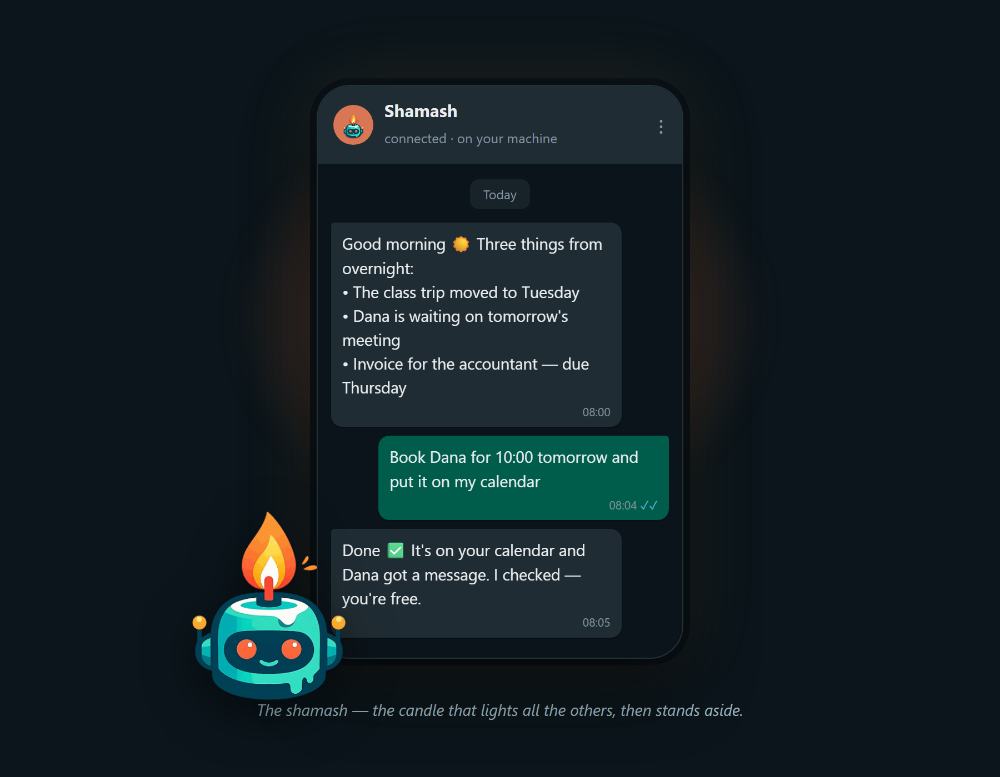
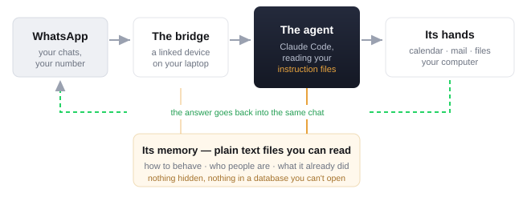

# Shamash

<p align="center">
  
</p>

*The shamash is the attendant candle — the one that lights the others and then
stands to the side.*

**[עברית](README.he.md)** 🇮🇱

A chief of staff for your WhatsApp, running on your own machine.

It reads your chats twice a day and sends you one digest: what it handled, what
it booked in your calendar, and what it deliberately left for you and why. You
can also just message it — in your own WhatsApp — and ask it to do things:
check your calendar, summarise a group you've ignored for a week, find a file,
answer somebody.

It is not a cloud service. There is no server, no account, and nothing to sign
up for. It runs on your computer, on your WhatsApp, and stops when you close it.

Two things that set it apart:

- **It runs on the Claude subscription you already pay for.** No API key, no
  per-message bill, no second account. If you have Claude Code, you have the
  engine.
- **Nothing phones home.** No telemetry, no analytics, no server of ours
  anywhere. Your messages live in a file on your disk and in your own Claude
  session — nowhere else.

📄 **[Welcome to Shamash (PDF)](docs/welcome/Welcome-to-Shamash.pdf)** — five
minutes, illustrated: what it does, how it works, where it stops, and the first
five things to send it. Your assistant sends you this itself, right after its
first hello — followed by [the avatar](docs/brand/shamash-avatar.png), so
it has a face in your chat list instead of a grey circle.

---

## Read this first

This gives WhatsApp messages a route to code running on your laptop, it can
send messages as you with no undo, and it pairs an unofficial client to your
personal WhatsApp account. **[RISKS.md](RISKS.md) — read it before you
install** ([עברית](RISKS.he.md)). The installer will make you confirm it
anyway.

> **Status: early.** This kit was extracted from one heavily-used personal
> installation and has not yet survived a stranger's machine. Early
> installers are test pilots — [docs/STATUS.md](docs/STATUS.md) is the honest
> ledger of what's proven and what isn't.

## What you need

- **Windows** (10 or 11). Only Windows for now.
- **Claude Code**, signed in — realistically on a **Max** plan.
- A computer that stays on. This is not a phone app.
- ~40 minutes. Most of it is the agent working, but the interview about your
  people, the QR scan, and the risk gate are genuinely yours — budget 15
  minutes of attention, not 2.
- **No second phone number.** It starts inside your own WhatsApp; the
  real-contact upgrade is optional, later, and explained when you're ready.

Optional, and the installer asks you about both:

- **Voice notes** — transcription of voice messages. A 3.3 GB download.
- **A spare phone number** — turns the agent into a real contact that *rings
  your phone*, instead of a group that quietly updates itself.

## Install

Open Claude Code in an empty folder and paste this:

```
Clone https://github.com/RSTjordan/shamash into this folder, then read
install/RUNBOOK.md and carry it out stage by stage. Stop and ask me wherever
the runbook says to stop. Don't skip the risk gate.
```

Then answer its questions. It builds the bridge, pairs your WhatsApp, asks you
who matters to you, sets up the scheduled jobs, and finishes by sending you a
real WhatsApp message and waiting for you to reply to it. Nothing counts as
installed until that round trip completes.

It is safe to re-run. Every stage is idempotent — a failure costs you one
stage, not the install.

## What it actually does

**Out of the box:**

- **Digest, twice a day** — what it did, what needs you, what's on your
  calendar, unread mail worth your attention.
- **On-demand commands** — message it in your own chat and it does the thing.
- **Talk while it works** — send a follow-up mid-task and it folds it into the
  work in progress, the way a person would. No queue, no "wait for it to
  finish".
- **Long-running projects** — hand it something multi-day ("take the ball on
  X") and a scheduled runner keeps advancing it in bounded work-shifts,
  reporting each one to your chat. The work survives the conversation that
  started it — and a stalled project tells you it stalled.
- **Calendar** — books meetings people ask you for, after checking you're
  actually free; turns "I'll send it tomorrow" into a reminder.
- **Approval cards** — anything risky stops and asks you in WhatsApp. React 👍
  and it proceeds.
- **Polls, not "reply 1/2/3"** — real WhatsApp polls for every choice,
  including approvals.

**Opt-in, because they cost something:**

- **Voice notes** (3.3 GB model download)
- **The agent as a real contact** (needs a second number, so it can send you
  alerts that actually ring)
- **Your own scheduled runs** — anything you can describe, on a schedule
  ([docs/JOBS.md](docs/JOBS.md) — there is no cron syntax; it's simpler).
- **Teleport** — continue any desk Claude Code session from WhatsApp, guarded
  by the same approval cards. Off by default: switched on, it gives WhatsApp
  reach into every project on your machine ([RISKS.md](RISKS.md) §1b). See
  [Teleport](#teleport) below for what using it actually looks like.

## How it works

Four moving parts. Worth knowing, because when something breaks you'll know
which box to look in.

<p align="center">
  
</p>

1. **It sees.** The bridge is a linked device, like WhatsApp Web. Every message
   lands in a SQLite file on your own disk — that file, not WhatsApp's API, is
   what everything else reads.
2. **It thinks.** A watcher notices new messages, builds a prompt out of them
   plus your instruction files, and runs Claude Code on it. Voice notes are
   transcribed locally first, if you enabled that.
3. **It acts.** Calendar, mail, your files, a shell — bounded by the rules in
   your brief, and every action is appended to a log keyed by message ID, so the
   same message can never be acted on twice.
4. **It reports.** The answer goes back into the same chat, and nothing counts
   as sent until the row is confirmed in the bridge's database. HTTP 200 is not
   delivery.

### Its mind is a folder of text files

No training, no profile of you on a server. Everything it knows about how to be
you is Markdown you can open:

| File | What it holds | Who writes it |
|---|---|---|
| `brief/AGENT_BRIEF.md` | The constitution — tone, what it may do alone, what it must never touch, how the digest is written. Injected whole into **every** run. | You, then it |
| `brief/PEOPLE.md` | Who's who: the nickname in your phone, the real name, how you talk to them. Tell it once and it writes the row itself. | It, from you |
| `prompts/*.md` | What each kind of run is *for* — the scan, an on-demand command, any job you add. | The kit |
| `.claude/skills/` | A procedure worth reusing. "Summarise a group like this" — saved once, followed forever. | It, on request |
| `state/` | The log, the timestamps, the schedule. Machine-written; it's how runs stay consistent with each other. | It |

The split matters for updates: the **kit** files (prompts, scripts, skills) are
ours and get replaced on `update`. **Your** files (brief, people, config, state)
are yours and are never touched. That's why a `git pull` can't overwrite your
assistant's personality.

Full wiring in [docs/ARCHITECTURE.md](docs/ARCHITECTURE.md).

## The part that makes it useful

The code is the cheap half. What makes this worth running is that it knows *who
your people are* — that the contact saved as "Big Man 😎" is your father, that
one group is noise and another is your job, that you never want it discussing
money on your behalf.

So the install interviews you, one question at a time, and every question
explains what it means before it asks. It will also read your busiest chats
after pairing and *propose* the who's-who list for you to correct, rather than
handing you a blank file.

The result is `brief/AGENT_BRIEF.md` — a plain-English document describing how
your assistant should behave. It's yours. Edit it whenever you like; the agent
reads it on every run, and updates never overwrite it.

## Teleport

You were working with Claude Code at your desk. You leave. The session is still
sitting there, holding everything you had loaded into it. Send your assistant a
single word:

```
teleport
```

It answers with a WhatsApp poll of your most recent desk sessions — the actual
conversations, newest first. Tap one, and from that moment your messages in this
chat go to *that* session instead of the assistant. Same context, same open
files, same train of thought, now on your phone. Name a project and it skips the
poll: `teleport into shamash`, or `continue the session where we were fixing the
scheduler`.

Anything the session wants to do that needs your say-so still arrives as an
approval card. To hand the session back to your desk, send:

```
release
```

An idle session releases itself on its own (4 hours by default).

Teleport is **off by default** and the installer asks before switching it on.
Read [RISKS.md](RISKS.md) §1b first — it is real reach into your machine from a
phone, and it deserves the deliberate yes.

## Updating

```
scripts\update.cmd
```

Pulls the latest (fast-forward only — it refuses if you've edited kit files),
restarts the watcher and scheduler, then runs `doctor`. Your config and your
brief are never touched. If a release changes the bridge patches or the
scheduled-task definitions, its release notes will say so — those two things
don't re-apply themselves.

When the WhatsApp pairing expires (~every 20 days, the one routine chore):
[docs/RE-PAIRING.md](docs/RE-PAIRING.md).

## Credits

The WhatsApp bridge is [whatsapp-mcp](https://github.com/lharries/whatsapp-mcp)
by Luke Harries, via [verygoodplugins'
fork](https://github.com/verygoodplugins/whatsapp-mcp). Both MIT. Shamash
clones it at install time rather than vendoring it.

## Support

This is a personal project I run on my own machine. No warranty, and I can't
promise a response time — but open an issue and I'll do my best to help. PRs
welcome.

MIT licensed.
